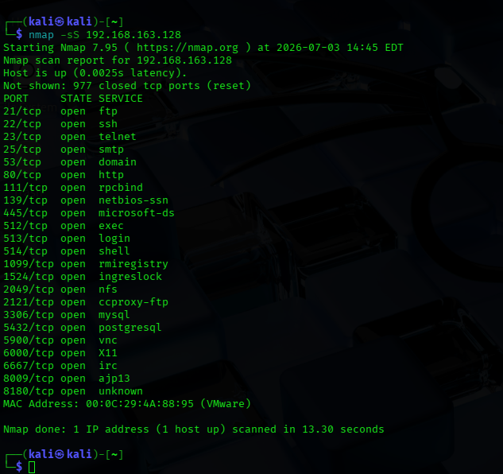
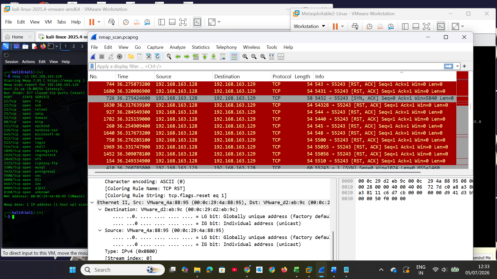
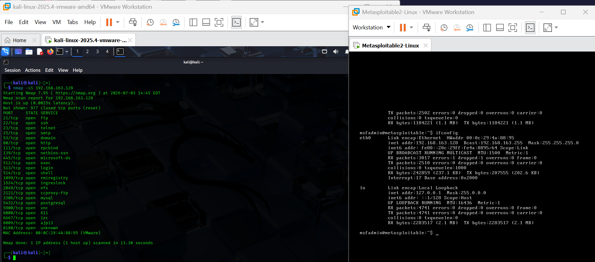

# Network Traffic Analysis & Security Assessment Lab

## Overview
A fully isolated virtual lab environment built to simulate network reconnaissance attacks and analyse traffic using industry-standard security tools. This project focuses on understanding how attackers scan for vulnerabilities and how defenders detect and document those activities.

## Lab Architecture
- **Attacker Machine:** Kali Linux
- **Target Machine:** Metasploitable 2
- **Hypervisor:** VMware
- **Network Configuration:** Host-Only (isolated from production/home networks)
- **Traffic Capture:** Npcap → Wireshark

## Tools Used
- **VMware** — Virtualisation and network isolation
- **Kali Linux** — Attack platform for reconnaissance
- **Metasploitable 2** — Intentionally vulnerable target
- **Nmap** — Port scanning and service enumeration
- **Wireshark** — Packet capture and traffic analysis
- **Npcap** — Packet capture driver

## What I Did

### 1. Environment Setup
- Installed Kali Linux and Metasploitable 2 as virtual machines in VMware
- Configured Host-Only networking to create a fully isolated testing environment
- Verified connectivity between attacker and target

### 2. Network Reconnaissance
- Executed Nmap SYN stealth scans (`nmap -sS`) against the target to enumerate open ports
- Identified running services on discovered ports

### 3. Traffic Analysis
- Captured live scan traffic using Wireshark via Npcap
- Filtered for TCP control packets (SYN, SYN-ACK, RST) to determine port states:
  - **SYN + SYN-ACK + RST** → Port open
  - **SYN + RST** → Port closed
  - **No response** → Port filtered

### 4. Findings
- Identified **23 open ports** on the target
- Critical vulnerabilities discovered:
  - **Port 21 (FTP)** — Transmitting credentials in cleartext
  - **Port 23 (Telnet)** — Unencrypted remote access
  - **Port 445 (SMB)** — Vulnerable to known exploits
- Multiple other services running with default configurations

### 5. Remediation Recommendations
- Replace Telnet with SSH (port 22)
- Replace FTP with SFTP/SCP
- Disable SMBv1 and apply latest security patches
- Implement firewall rules to restrict access to necessary ports only
- Conduct regular vulnerability scans

## What I Learned
- How to safely build an isolated testing environment for security assessments
- How attackers use port scanning to map attack surfaces
- How to interpret TCP flags at the packet level to understand scan results
- How to translate technical findings into actionable remediation steps
- The importance of documentation in security testing workflows

## Screenshots

### Nmap Scan Results

### Wireshark Traffic Analysis

### Lab Setup

## Future Improvements
- Automate scanning and reporting with Python scripts
- Integrate vulnerability scanning with OpenVAS
- Expand the lab to include additional targets and attack scenarios

---

**Built as part of my practical cybersecurity training | 2025**
